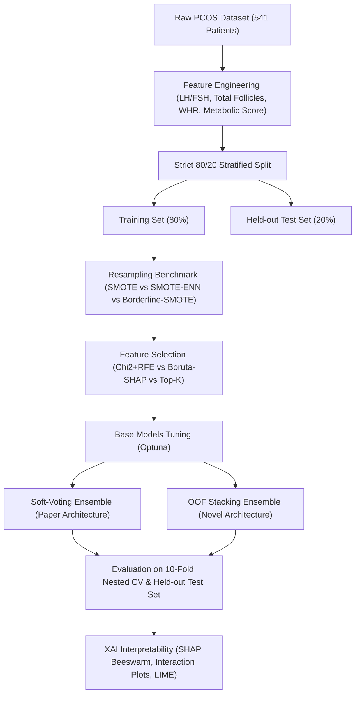

# 🔬 Advanced PCOS Prediction: Experimentation & Research Plan

A systematic benchmark and exploration blueprint to surpass the state-of-the-art results established in *Health Science Reports (Wiley, 2026)* (Baseline: **96.33% Test Accuracy / 92.04% 10-Fold CV**).

---

## 🎯 Benchmark Targets to Beat

| Metric | Paper Baseline (XGB + MLP) | Our Target |
|---|:---:|:---:|
| **Test Accuracy** | 96.33% | **$\ge$ 97.50%** |
| **10-Fold Stratified CV Accuracy** | 92.04% ± 2.58% | **$\ge$ 94.50%** |
| **Precision / Recall / F1** | 96.35% / 96.33% / 96.30% | **$\ge$ 97.00%** |
| **ROC-AUC** | 0.98 - 1.00 | **$\ge$ 0.995** |
| **Overfitting Gap** | 2.98% | **$\le$ 2.00%** |

---

## 🧪 5 Pillars of Novelty & Improvement

### 1. 🧬 Clinical Domain Feature Engineering (The Endocrinology Advantage)
The paper utilized raw features without biomedical interaction terms. We introduce validated clinical endocrinology indicators:
- **$\text{LH/FSH Ratio}$:** Elevated LH relative to FSH ($\text{Ratio} > 2.0$) is a hallmark diagnostic indicator of PCOS.
- **$\text{Total Follicle Count} = \text{Follicle (L)} + \text{Follicle (R)}$:** Aggregate ovarian follicle density.
- **$\text{Follicle Asymmetry Index} = \frac{|\text{Follicle (L)} - \text{Follicle (R)}|}{\text{Follicle (L)} + \text{Follicle (R)} + 10^{-5}}$:** Measures unilateral vs. bilateral cyst concentration.
- **$\text{Calculated BMI} = \frac{\text{Weight (kg)}}{(\text{Height (cm)} / 100)^2}$:** Validates and standardizes metabolic load.
- **$\text{Waist-to-Hip Ratio (WHR)} = \frac{\text{Waist}}{\text{Hip}}$:** Abdominal adiposity marker.
- **$\text{Metabolic Syndrome Score} = \text{Weight Gain} + \text{Skin Darkening} + \text{Hair Growth} + \text{Pimples} + \text{Fast Food}$:** High-order clinical symptom aggregation.
- **$\text{AMH} \times \text{Total Follicles}$:** Interaction feature reflecting granulosa cell follicle production.

### 2. ⚖️ Advanced Resampling & Boundary Cleaning
Standard SMOTE creates linear interpolations that can pollute complex decision boundaries.
- **SMOTE-ENN:** Synthesizes minority instances and subsequently applies Edited Nearest Neighbors (ENN) to purge noisy, overlapping border points.
- **Borderline-SMOTE:** Concentrates synthetic generation strictly along the decision boundary where misclassifications occur.
- **ADASYN:** Adaptively weights minority samples based on the density of majority neighbors.

### 3. 🔍 Superior Feature Selection (Boruta-SHAP vs. Chi2+RFE)
- **Boruta-SHAP:** Evaluates non-linear feature importance against shadow randomized features using Tree-SHAP, preserving complex interaction effects that univariate $\chi^2$ misses.
- **Mutual Information + Dynamic RFE:** Captures non-linear dependencies without requiring monotonic scaling.

### 4. 🧠 State-of-the-Art Modeling & Stacking Architecture
- **Optuna Bayesian Hyperparameter Optimization:** 100+ trials per model for hyperparameter tuning (learning rate, tree depth, regularization, subsampling, neural layer sizes).
- **Out-Of-Fold (OOF) Stacking Ensemble:**
  - **Level-0 Diverse Base Classifiers:**
    1. CatBoost (Ordered Boosting)
    2. LightGBM (GOSS)
    3. XGBoost (Exact Tree Method)
    4. Deep MLP with Residual Skip Connections & GELU activation
    5. Extra Trees Classifier (Extremely Randomized Trees)
  - **Level-1 Meta-Learner:** Regularized Logistic Regression (ElasticNet) / Ridge Classifier trained strictly on out-of-fold probability distributions.
- **Probability Calibration (Isotonic / Platt Scaling):** Calibrates output probabilities for clinical decision-making.

### 5. 🛡️ Strict Zero-Leakage 10-Fold Nested Cross-Validation
- Preprocessing, Feature Engineering, Resampling, Feature Selection, and Model Tuning are strictly isolated **inside each validation fold** to eliminate optimistic bias.

---

## 📊 Experimental Matrix

---

## 🚀 Execution Roadmap

1. **Phase 1: Environment & Virtualenv Setup** (Installing CatBoost, LightGBM, Optuna, imbalanced-learn, SHAP, LIME).
2. **Phase 2: Feature Engineering & Preprocessing Pipeline** (`src/feature_engineering.py`).
3. **Phase 3: Resampling & Feature Selection Optimization** (`experiments/exp1_feature_selection.py`).
4. **Phase 4: Hyperparameter Tuning via Optuna** (`experiments/exp2_optuna_tuning.py`).
5. **Phase 5: Stacking Ensemble & Benchmark Comparison** (`experiments/exp3_stacking_ensemble.py`).
6. **Phase 6: Final Results Synthesis & XAI Deep Dive** (`EXPERIMENT_RESULTS.md`).
