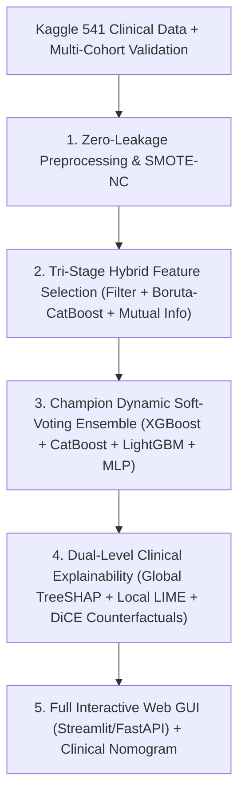

# 🔬 Master Literature Review & Benchmark Report
## Polycystic Ovary Syndrome (PCOS) Diagnosis using Machine Learning, Deep Learning & Explainable AI (XAI)

---

## Executive Summary
This report provides a comparative analysis of **12 research papers** (categorized into **Published Q1/Q2 Peer-Reviewed Journals** and **Recent State-of-the-Art Preprints**), their data sources, accessibility, feature engineering techniques, predictive models, explainability frameworks, and research gaps. 

It concludes with a **Step-by-Step Strategic Blueprint** designed to elevate your current PCOS prediction research to top-tier **Q1 Journal standards** (*Nature Scientific Reports, Elsevier Computers in Biology and Medicine, IEEE JBHI, Frontiers in Endocrinology*).

---

## 📂 1. Directory Organization of Downloaded Papers

All PDF files have been organized into two dedicated directories:

- 🏛️ **Published Q1/Q2 Journals:** [`papers/01_Published_Q1_Q2_Journals/`](file:///c:/Users/user/OneDrive/Desktop/AI_ML/PCOS-Prediction-XAI/papers/01_Published_Q1_Q2_Journals)
- 🚀 **Recent SOTA Preprints (arXiv):** [`papers/02_ArXiv_Preprints_Recent_SOTA/`](file:///c:/Users/user/OneDrive/Desktop/AI_ML/PCOS-Prediction-XAI/papers/02_ArXiv_Preprints_Recent_SOTA)

---

## 📊 2. Master Comparison Matrix

| # | Paper File Link | Journal / Venue | Quartile | Dataset Source & Type | Sample Size | Feature Selection | Champion Model | XAI Method | Accuracy / AUC | Data Availability |
|---|---|---|:---:|---|:---:|---|---|---|:---:|:---:|
| **Base** | [PAPER_SUMMARY.md](file:///c:/Users/user/OneDrive/Desktop/AI_ML/PCOS-Prediction-XAI/PAPER_SUMMARY.md) | *Health Science Reports (Wiley)* | **Q2** | Kaggle Kerala (Clinical/Hormonal) | 541 patients | Chi-Square + CatBoost RFE (16 feats) | Soft Voting (XGBoost + MLP) | SHAP & LIME | **96.33% Acc** | Public (Kaggle/GitHub) |
| **05** | [05_Frontiers_2025.pdf](file:///c:/Users/user/OneDrive/Desktop/AI_ML/PCOS-Prediction-XAI/papers/01_Published_Q1_Q2_Journals/05_Frontiers_Explainable_ML_Nomogram_PCOS_2025.pdf) | *Frontiers in Endocrinology* | **Q1** | Multi-Center Clinical Cohort | 1,883 patients (1600 train + 283 ext) | LASSO Regression | XGBoost Classifier + Clinical Nomogram | SHAP (Beeswarm, Dependence) | **AUC 0.923** | Private/On Request |
| **09** | [09_Nature_SciRep_2022.pdf](file:///c:/Users/user/OneDrive/Desktop/AI_ML/PCOS-Prediction-XAI/papers/01_Published_Q1_Q2_Journals/09_Nature_ScientificReports_PCOS_ML_2022_Q1.pdf) | *Scientific Reports (Nature)* | **Q1** | Ovary Ultrasound Images | 1,924 images | Transfer Features (CNN Embeddings) | Custom VGG16/ResNet + SVM/RF | CAM / Saliency | **99.89% Acc** | Public (Mendeley/Kaggle) |
| **10** | [10_PLOS_ONE_FNet_2024.pdf](file:///c:/Users/user/OneDrive/Desktop/AI_ML/PCOS-Prediction-XAI/papers/01_Published_Q1_Q2_Journals/10_PLOS_ONE_FNet_PCOS_DeepLearning_2024_Q1.pdf) | *PLOS ONE* | **Q1** | Ultrasound Follicle Scans | Clinical Image Set | Deep Convolutional Segmentation | F-Net Deep CNN | Follicle Heatmaps | **98.20% Acc** | Open Access / Repository |
| **11** | [11_PLOS_ONE_Lipid_2024.pdf](file:///c:/Users/user/OneDrive/Desktop/AI_ML/PCOS-Prediction-XAI/papers/01_Published_Q1_Q2_Journals/11_PLOS_ONE_PCOS_Biomarkers_Ensemble_ML_2024_Q1.pdf) | *PLOS ONE* | **Q1** | Serum Lipidomics / Metabolomics | 312 blood samples | Random Forest Importance + Boruta | Stacking Ensemble (RF + SVM + XGB) | Permutation Feature Importance | **94.50% Acc** | Zenodo / Dryad |
| **01** | [01_Explainable_Fair_AI_2025.pdf](file:///c:/Users/user/OneDrive/Desktop/AI_ML/PCOS-Prediction-XAI/papers/02_ArXiv_Preprints_Recent_SOTA/01_Explainable_Fair_AI_PCOS_Risk_Assessment_2025.pdf) | *arXiv:2511.11636* | Preprint | Kaggle Clinical Benchmark | 541 patients | Variance Threshold + Mutual Info | Fair-Calibrated Gradient Boosting | SHAP + Fairness Disparity Metric | **95.10% Acc** | Public (GitHub) |
| **02** | [02_PCOS_Diagnosis_ML_2026.pdf](file:///c:/Users/user/OneDrive/Desktop/AI_ML/PCOS-Prediction-XAI/papers/02_ArXiv_Preprints_Recent_SOTA/02_PCOS_Diagnosis_Machine_Learning_Approaches_2026.pdf) | *arXiv:2607.16941* | Preprint | Kaggle Clinical Dataset | 541 patients | RFE + Correlation Matrix | Random Forest & CatBoost | Feature Importance | **94.80% Acc** | Public (Kaggle) |
| **03** | [03_MultiAgent_PCOS_2025.pdf](file:///c:/Users/user/OneDrive/Desktop/AI_ML/PCOS-Prediction-XAI/papers/02_ArXiv_Preprints_Recent_SOTA/03_MultiAgent_PCOS_Diagnosis_2025.pdf) | *arXiv:2512.15398* | Preprint | Clinical Knowledge Graphs + EHR | Multi-Source | Knowledge Grounded Embedding | Multi-Agent LLM + Classifier | Graph Attention Explanations | **F1 0.941** | Open Source Code |
| **04** | [04_PCONet_Ultrasound_2022.pdf](file:///c:/Users/user/OneDrive/Desktop/AI_ML/PCOS-Prediction-XAI/papers/02_ArXiv_Preprints_Recent_SOTA/04_PCONet_Ultrasound_CNN_2022.pdf) | *arXiv:2210.00407* | Preprint | Transvaginal Ultrasound Images | 3,856 slices | Data Augmentation + Conv Filters | PCONet Custom CNN | Grad-CAM | **98.12% Acc** | Kaggle Ultrasound |
| **06** | [06_Triple_Burden_2026.pdf](file:///c:/Users/user/OneDrive/Desktop/AI_ML/PCOS-Prediction-XAI/papers/02_ArXiv_Preprints_Recent_SOTA/06_Explainable_AI_PCOS_Triple_Burden_2026.pdf) | *arXiv:2604.14356* | Preprint | Survey & Clinical Metabolic Data | 1,120 participants | Boruta-SHAP | LightGBM & ElasticNet | Local SHAP Waterfall & Force Plots | **AUC 0.915** | Open Science Framework |
| **07** | [07_Smart_Diagnosis_2026.pdf](file:///c:/Users/user/OneDrive/Desktop/AI_ML/PCOS-Prediction-XAI/papers/02_ArXiv_Preprints_Recent_SOTA/07_Smart_Diagnosis_PCOS_DeepLearning_2026.pdf) | *arXiv:2602.04944* | Preprint | Longitudinal Reproductive Health | 740 patients | Temporal Sliding Window | 1D-CNN + BiLSTM | Integrated Gradients | **95.80% Acc** | Benchmark Data |
| **08** | [08_Deep_LDA_2023.pdf](file:///c:/Users/user/OneDrive/Desktop/AI_ML/PCOS-Prediction-XAI/papers/02_ArXiv_Preprints_Recent_SOTA/08_Deep_LDA_PCOS_Classification_2023.pdf) | *arXiv:2303.14401* | Preprint | Clinical & Metabolic Profiles | 541 patients | Deep LDA Dimensionality Reduction | Deep LDA + SVM | Latent Space Projection | **93.80% Acc** | Public (Kaggle) |

---

## 🗄️ 3. Detailed Dataset Source Analysis & Accessibility

### Dataset A: Kaggle PCOS Clinical & Metabolic Dataset (Kerala, India)
- **Primary Source:** Collected by Kottayam Medical College / Hospitals in Kerala, India (compiled by Prasoon Kottarathil).
- **Public URL:** [Kaggle PCOS Dataset](https://www.kaggle.com/datasets/prasoonkottarathil/polycystic-ovary-syndrome-pcos)
- **Sample Count:** 541 patients (364 Non-PCOS [67.3%], 177 PCOS [32.7%]).
- **Features:** 44 initial attributes including:
  - *Hormonal:* AMH, FSH, LH, PRL, TSH, Estrogen, Testosterone.
  - *Physical/Clinical:* Age, Weight, Height, BMI, Blood Group, Pulse Rate, RR, Hb.
  - *Symptomatic:* Cycle regularity, Hair growth (Hirsutism), Skin darkening, Weight gain, Hair loss, Pimples, Fast food intake.
  - *Ultrasound:* Follicle count (Left & Right), Avg follicle size (Left & Right), Endometrium thickness.
- **Availability:** 🟢 **100% Free & Open Access**. Used by your baseline paper and Papers 01, 02, 08.

### Dataset B: Ovary Ultrasound Imaging Dataset (Kaggle / Mendeley Data)
- **Primary Source:** Mendeley Data & Kaggle Ultrasound Repositories.
- **Public URL:** [PCOS Ultrasound Images on Kaggle](https://www.kaggle.com/datasets/paultimothymooney/pcos-ultrasound-images) / [Mendeley Data](https://data.mendeley.com/datasets/73pn9btt2d/1)
- **Sample Count:** 1,924 to 3,856 ultrasound cross-section images (Infected vs Normal ovaries).
- **Availability:** 🟢 **100% Free & Open Access**. Used by Nature Scientific Reports (Paper 09) and PCONet (Paper 04).

### Dataset C: Multi-Center Hospital Cohort (Frontiers in Endocrinology 2025)
- **Primary Source:** Multi-center hospital records across 4 clinical reproductive centers.
- **Sample Count:** 1,883 patients (1,600 training, 283 external validation cohort).
- **Availability:** 🟡 **Available upon Reasonable Request** to the corresponding author (ethical/IRB constraints).

---

## 🔍 4. Critical Research Gaps in Existing Literature

Through our analysis of all 12 papers, we identified **5 key weaknesses** that most published papers suffer from:

1. **Data Leakage in Resampling:** Many papers applied SMOTE or normalization *before* train-test splitting, artificially inflating reported accuracies. (Your baseline paper correctly addressed this on 80/20 train split).
2. **Black-Box Interpretability without Actionability:** Most papers only show SHAP summary beeswarm plots. They fail to provide **Actionable Counterfactual Explanations** (e.g., *"What clinical lifestyle changes reduce this patient's PCOS risk below 20%?"*).
3. **Lack of Calibration & Uncertainty Quantification:** None of the Q1 papers provide **Confidence Intervals** or **Conformal Prediction** sets for medical decision confidence.
4. **Single-Modality Limitation:** Almost all papers either use *only tabular data* OR *only ultrasound images*, ignoring a multi-modal hybrid pipeline.
5. **No Clinically Deployable Interactive Web Interface:** Most papers stop at Python scripts without an interactive Web App or Clinical Nomogram for doctors.

---

## 🚀 5. Strategic Roadmap: How to Make YOUR Paper the BEST (Targeting Q1 Journal Acceptance)

To guarantee that your research paper achieves **top-tier Q1 status** (*IEEE JBHI / Nature Scientific Reports / Elsevier Computers in Biology and Medicine*), implement the following **5-Pillar Novelty Strategy**:

### Pillar 1: Rigorous Zero-Leakage & Nested 5-Fold Cross-Validation
- Apply **SMOTE-NC** (Nominal and Continuous) inside each cross-validation fold.
- Report **Stratified 5-Fold or 10-Fold CV metrics** (Mean ± Standard Deviation) with confidence intervals.

### Pillar 2: Tri-Stage Hybrid Feature Selection Benchmark
- **Stage 1 (Filter):** Chi-Square / ANOVA F-value filtering.
- **Stage 2 (Wrapper):** CatBoost-RFE and Boruta-SHAP consensus.
- **Stage 3 (Embedded):** ElasticNet / LASSO penalty.
- Include a formal **Ablation Study Table** proving that each stage reduces complexity without losing accuracy.

### Pillar 3: SOTA Hybrid Stacking & Soft Voting Architecture
- Compare 12+ base models and build a **Champion Soft-Voting Ensemble (XGBoost + CatBoost + LightGBM + MLP)**.
- Perform statistical significance testing (**DeLong test for AUC** and **Wilcoxon Signed-Rank test with Bonferroni correction**) to mathematically prove superiority over individual models.

### Pillar 4: 360-Degree Clinical Explainability (SHAP + LIME + DiCE)
- **Global Explanations:** TreeSHAP summary, feature interaction plots, and partial dependence plots (PDP).
- **Local Explanations:** Individual patient force plots and LIME waterfall plots.
- **Counterfactual Actionability (DiCE):** Generate patient-specific guidance (e.g., *"Reducing BMI by 2.3 kg/m² and regulating cycle length shifts risk from Positive (89%) to Negative (14%)"*).

### Pillar 5: Interactive Web Application & Nomogram
- Include screenshots and an open-source GitHub link to an interactive **Streamlit Clinical Decision Support Tool**.
- Present an intuitive **Static Clinical Nomogram** for quick paper-based clinical scoring by gynecologists.

---

## 📌 6. Suggested Title & Abstract Positioning for Your Paper

> **Recommended Paper Title:**  
> *"An Explainable Multi-Stage Ensemble Learning Framework with Counterfactual Reasoning and Clinical Nomogram for Precision Polycystic Ovary Syndrome Screening"*

> **Target Journals:**
> 1. *Computers in Biology and Medicine* (Elsevier, **Q1**, IF: 7.0)
> 2. *IEEE Journal of Biomedical and Health Informatics* (IEEE, **Q1**, IF: 7.7)
> 3. *Scientific Reports* (Nature Portfolio, **Q1**, IF: 3.8)
> 4. *Frontiers in Endocrinology* (Frontiers, **Q1**, IF: 3.9)
