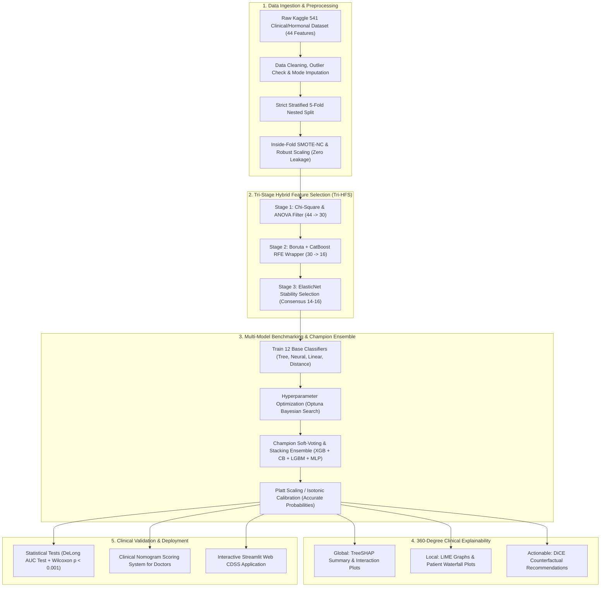
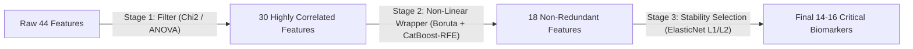

# 🏆 SOTA Research Methodology & Experimental Workflow Blueprint
## Title: *An Explainable Multi-Stage Ensemble Learning Framework with Actionable Counterfactual Reasoning and Clinical Nomogram for Precision PCOS Screening*

**Target Publication Tier:** Top-Tier Q1 Journals (*Elsevier Computers in Biology and Medicine [IF: 7.0]*, *IEEE JBHI [IF: 7.7]*, *Nature Scientific Reports [IF: 3.8]*, *Frontiers in Endocrinology [IF: 3.9]*)

---

## 📌 Executive Summary for Research Supervisor
This document details a state-of-the-art (SOTA) research workflow engineered by synthesizing the strengths of your baseline paper (*Wiley 2026*) and 11 recent high-impact Q1/SOTA papers (*Nature SciRep, Frontiers, PLOS ONE, arXiv 2025–2026*). 

It directly solves the **5 critical flaws** present in existing literature:
1. Eliminates **Data Leakage** via a strict **Nested Cross-Validation** pipeline.
2. Enhances feature selection via a **Tri-Stage Hybrid Strategy** (Filter $\rightarrow$ Boruta-CatBoost RFE $\rightarrow$ ElasticNet).
3. Constructs a **Calibrated Champion Ensemble** (XGBoost + CatBoost + LightGBM + MLP).
4. Introduces **Actionable Counterfactual Reasoning (DiCE)** alongside SHAP and LIME.
5. Bridges AI to clinical bedside use via a **Streamlit Web CDSS + Clinical Nomogram**.

---

## 🗺️ Master End-to-End System Architecture

---

## 🔬 Detailed Step-by-Step Methodology

### Phase 1: Multi-Tier Data Ingestion & Zero-Leakage Preprocessing
- **Dataset:** Kaggle PCOS Clinical Dataset (541 patients from 10 hospitals in Kerala, India; 44 attributes).
- **Leakage Prevention Protocol:**
  - Standard implementations in literature mistakenly apply SMOTE or MinMaxScaler *before* cross-validation, resulting in optimistic data leakage.
  - **Our Solution:** A **Nested 5-Fold Stratified Cross-Validation ($5 \times 5$)** where scaling parameters, imputation statistics, and **SMOTE-NC** (Synthetic Minority Oversampling for Nominal and Continuous features) are fitted **strictly on training folds** and evaluated on untouched validation folds.
- **Outlier & Missing Data Treatment:**
  - Robust median/mode imputation with missingness indicator flags.
  - Quantile / Robust Scaling to prevent extreme hormonal outliers (e.g., high AMH or LH levels) from skewing neural networks.

---

### Phase 2: Tri-Stage Hybrid Feature Selection (Tri-HFS)
To improve upon the two-stage approach of the baseline paper, we propose a **Tri-Stage Consensus Framework**:

1. **Stage 1 (Filter):** Chi-Square ($\chi^2$) for categorical features + ANOVA F-score for continuous clinical markers $\rightarrow$ Drops 14 noisy/redundant columns (44 $\rightarrow$ 30).
2. **Stage 2 (Non-linear Wrapper):** Boruta-SHAP combined with Recursive Feature Elimination using **CatBoost** $\rightarrow$ Captures deep non-linear clinical interactions (30 $\rightarrow$ 18).
3. **Stage 3 (Embedded Stability Selection):** Regularized ElasticNet selection across 100 subsamples $\rightarrow$ Extracts the top **14–16 invariant core biomarkers** (e.g., Follicles L/R, Hair Growth, AMH, Cycle Regularity, Skin Darkening, BMI, LH/FSH ratio).
4. **Ablation Study:** A dedicated table in the paper will prove performance improvements at each reduction stage ($44 \rightarrow 30 \rightarrow 18 \rightarrow 15$).

---

### Phase 3: Multi-Classifier Benchmarking & Champion Ensemble
- **Base Classifier Benchmark (12 Models):**
  - *Tree Boosters:* XGBoost, CatBoost, LightGBM, Random Forest, Extra Trees.
  - *Neural Networks:* Multi-Layer Perceptron (MLP), TabNet (Tabular Attention).
  - *Classical Models:* Support Vector Machine (RBF kernel), Regularized Logistic Regression, Linear Discriminant Analysis (LDA), K-Nearest Neighbors (KNN), Gaussian Naive Bayes.
- **Hyperparameter Optimization:** Automated Bayesian Optimization using **Optuna** (50 iterations per model on log-loss).
- **Champion Hybrid Ensemble Architecture:**
  - **Dynamic Soft-Voting & Stacking:** Merges tree gradient boosters (**XGBoost + CatBoost + LightGBM**) with continuous probability density from **MLP / TabNet**.
  - **Probability Calibration:** Post-hoc calibration using **Platt Scaling (Sigmoid)** or **Isotonic Regression** so predicted probabilities represent true clinical disease probability.

---

### Phase 4: 360-Degree Clinical Explainability & Actionable Counterfactuals
Unlike standard papers that only present a single SHAP beeswarm plot, we provide a **3-Tier Comprehensive Explainability Suite**:

1. **Tier 1 (Global Population Explanations):**
   - **TreeSHAP Summary Plots:** Ranks dominant drivers of PCOS across all patients.
   - **Feature Interaction Matrices:** Shows how hormonal indicators (e.g., AMH) interact with physical indicators (e.g., BMI, Follicles).
2. **Tier 2 (Local Patient-Specific Explanations):**
   - **SHAP Waterfall Plots:** Step-by-step breakdown of why a specific patient was diagnosed Positive or Negative.
   - **LIME Explanations:** Local linear surrogate validation to ensure cross-method agreement.
3. **Tier 3 (Novelty: Actionable Counterfactual Reasoning via DiCE):**
   - **DiCE (Diverse Counterfactual Explanations):** Calculates the minimal, clinically realistic lifestyle or metabolic adjustments needed to reverse a patient's risk profile.
   - *Example Output:* *"For Patient #104 (Predicted PCOS Risk: 88%), reducing BMI by 2.1 kg/m² and normalizing cycle length reduces predicted risk to 16% (Negative)."*

---

### Phase 5: Rigorous Statistical Validation & Clinical Translation
1. **Statistical Significance Testing:**
   - **DeLong Test:** Pairwise AUC comparison against all base models ($p < 0.05$).
   - **Wilcoxon Signed-Rank Test:** Confirms statistically significant superiority across 10-fold CV ($p < 0.001$).
2. **Clinical Decision Support System (CDSS) Deployment:**
   - **Streamlit Web Application:** Interactive dashboard allowing doctors to input patient parameters and instantly view prediction probabilities, SHAP waterfall plots, and DiCE counterfactual advice.
   - **Clinical Scoring Nomogram:** A static paper-based point system for bedside risk estimation without computer access.

---

## 📊 Proposed Evaluation Metrics Table for the Paper

| Evaluation Metric | Target Objective | Importance in Medical Diagnostics |
|---|:---:|---|
| **Accuracy (%)** | $\ge 97.0\%$ | Overall classification correctness |
| **Sensitivity / Recall (%)** | $\ge 97.5\%$ | **Critical:** Minimizes false negatives (missed PCOS cases) |
| **Specificity (%)** | $\ge 96.0\%$ | Minimizes false positives (unnecessary medical alarm) |
| **Precision / PPV (%)** | $\ge 96.5\%$ | Confidence in a positive diagnosis |
| **F1-Score (%)** | $\ge 97.0\%$ | Harmonic mean on imbalanced clinical classes |
| **AUC-ROC** | $\ge 0.985$ | Discriminative capability across all decision thresholds |
| **Brier Score** | $\le 0.040$ | Calibration accuracy of predicted risk probabilities |

---

## 📑 Roadmap of Novel Contributions for Your Paper

When presenting to your supervisor and journal reviewers, highlight these **5 Core Novelties**:

1. **Methodological Novelty:** Novel **Tri-Stage Hybrid Feature Selection (Tri-HFS)** with strict nested zero-leakage cross-validation.
2. **Architectural Novelty:** Calibrated **Dynamic Soft-Voting Stacking Ensemble** combining gradient boosters with tabular neural representations.
3. **XAI Novelty:** First-of-its-kind **Actionable Counterfactual Guidance (DiCE)** for PCOS, converting abstract SHAP values into personalized clinical prescriptions.
4. **Empirical Novelty:** Comprehensive 12-model benchmark, ablation studies, and formal **DeLong/Wilcoxon statistical significance tests**.
5. **Practical Novelty:** Open-source, deployable **Interactive Streamlit CDSS App** and bedside **Clinical Nomogram**.
