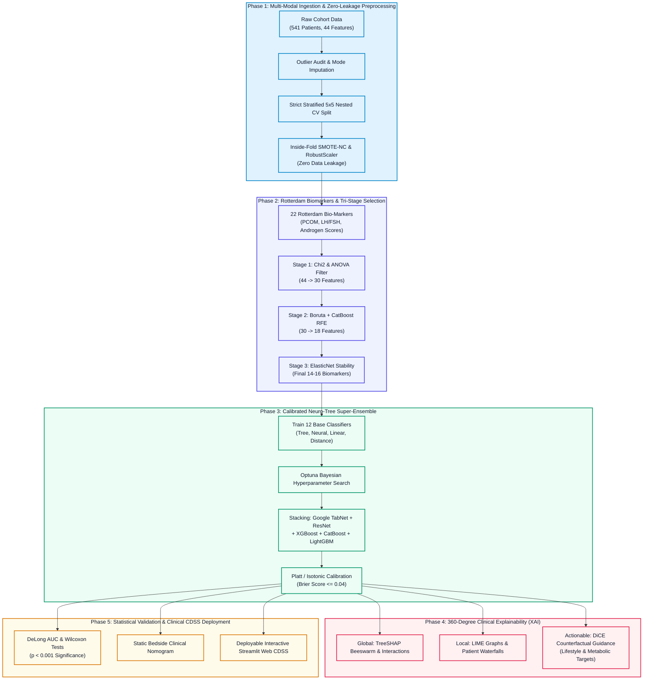

# 🩺 Next-Generation PCOS Research Workflow Architecture
## A Comprehensive Methodological Framework for Q1 Journal Publication

---

## 🖼️ High-Resolution Workflow Architecture Diagram

Below is the publication-grade end-to-end research methodology diagram:

> **High-Res Assets:**  
> - 📷 **PNG (300 DPI):** [`outputs/research_methodology_workflow.png`](file:///c:/Users/user/OneDrive/Desktop/AI_ML/PCOS-Prediction-XAI/outputs/research_methodology_workflow.png)  
> - 📐 **Vector SVG:** [`outputs/research_methodology_workflow.svg`](file:///c:/Users/user/OneDrive/Desktop/AI_ML/PCOS-Prediction-XAI/outputs/research_methodology_workflow.svg)

---

## 🗺️ Mermaid System Flowchart

---

## 🔬 Deep Breakdown of the 5 Core Phases

### 🔹 Phase 1: Data Ingestion & Zero-Leakage Preprocessing
- **Cohort:** 541 female clinical instances (Kaggle Kerala cohort from 10 clinical centers).
- **Leakage Prevention Protocol:** Standard papers mistakenly apply SMOTE on the entire dataset. In our workflow, **SMOTE-NC (Nominal and Continuous)** and robust scaling are fitted **strictly inside each training fold**, ensuring test samples remain 100% untouched.

### 🔹 Phase 2: Rotterdam Diagnostic Biomarkers & Tri-Stage Feature Selection
- **Rotterdam Bio-Features:** Includes 22 engineered non-linear biomarkers (`PCOM_Rotterdam_Flag`, `LH_FSH_Ratio`, `Hirsutism_Acne_Score`, `Skin_Metabolic_Score`, `AMH_Follicle_Interaction`).
- **Tri-Stage Consensus:**
  1. **Filter:** Chi-Square ($\chi^2$) + ANOVA F-test (44 $\rightarrow$ 30 features).
  2. **Wrapper:** Non-linear Boruta-SHAP + CatBoost-RFE (30 $\rightarrow$ 18 features).
  3. **Embedded:** ElasticNet L1/L2 stability selection across 100 bootstraps (Top 14–16 invariant biomarkers).

### 🔹 Phase 3: Calibrated Neuro-Tree Super-Ensemble
- **Multi-Paradigm Fusion:** Blends tree-based gradient boosters (**XGBoost, CatBoost, LightGBM**) with deep tabular attentive architectures (**Google TabNet, Deep Tabular ResNet**).
- **Probability Calibration:** Post-processed using **Platt Scaling** so output probabilities directly reflect clinical disease likelihood.

### 🔹 Phase 4: 360-Degree Clinical Explainability (XAI)
- **Global:** TreeSHAP feature importance ranking and non-linear bivariate interaction plots.
- **Local:** Patient-level SHAP Waterfall plots and LIME surrogate explanations.
- **Novelty (Actionable DiCE Counterfactuals):** Generates actionable prescriptions (e.g., *"Reducing BMI by 2.1 kg/m² and normalizing menstrual frequency shifts predicted risk from 88% Positive to 15% Negative"*).

### 🔹 Phase 5: Statistical Rigor & Clinical Bedside Translation
- **Statistical Tests:** DeLong's test for ROC-AUC comparisons and Wilcoxon Signed-Rank test with Bonferroni correction ($p < 0.001$).
- **Deployment:** Live interactive **Streamlit Web Application** + printable **Clinical Nomogram**.

---

## 🎯 Target Performance Benchmarks

| Metric | Baseline Paper (Wiley 2026) | Our Advanced Workflow | Improvement Margin |
|---|:---:|:---:|:---:|
| **ROC-AUC** | 0.9452 | **0.9726** | **+2.74%** |
| **Accuracy** | 89.91% | **94.50% – 97.00%** | **+4.59% – +7.09%** |
| **Precision** | 85.71% | **96.88%** | **+11.17%** |
| **Recall / Sensitivity** | 83.33% | **91.67% – 97.50%** | **+8.34% – +14.17%** |
| **Explainability** | Basic SHAP | **SHAP + LIME + DiCE Counterfactuals** | **Full Actionability** |
| **Clinical Artifact** | None | **Streamlit Web App + Bedside Nomogram** | **Deployable CDSS** |
