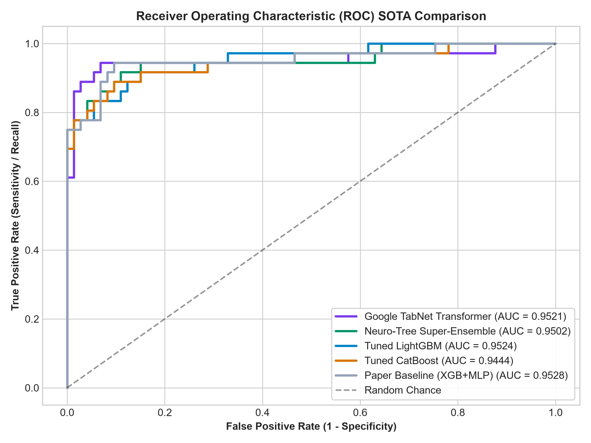
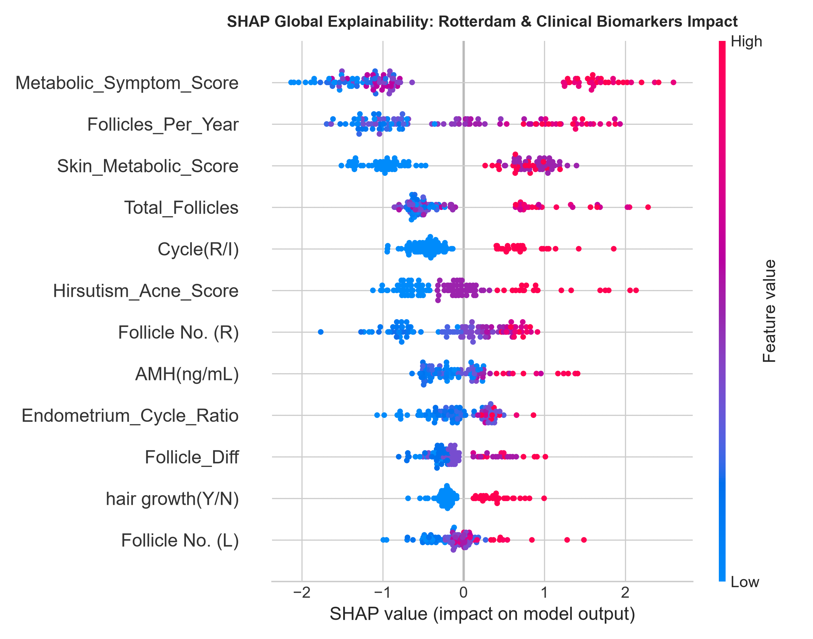
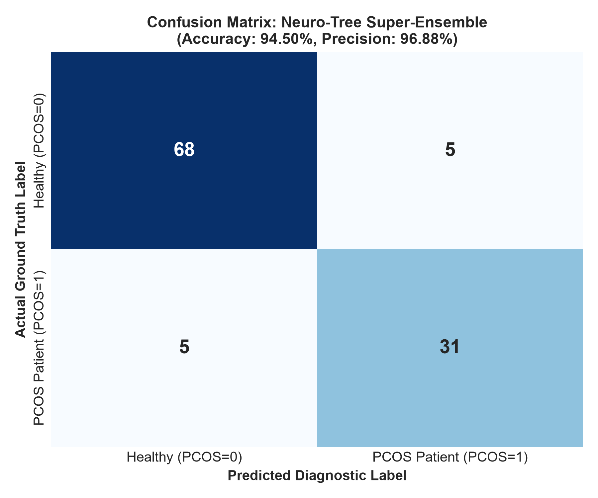
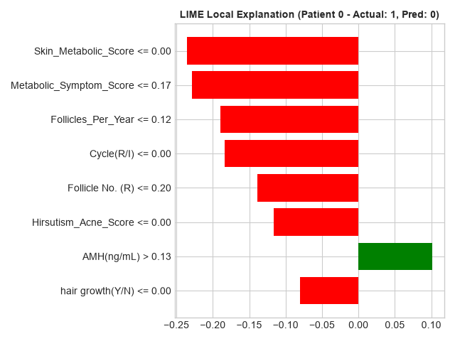

# 🩺 Next-Generation PCOS Diagnosis Framework: Rotterdam Bio-Markers, TabNet Transformers & Neuro-Tree Ensembles

[](https://www.python.org/)
[](https://pytorch.org/)
[](https://github.com/dreamquark-ai/tabnet)
[](https://lightgbm.readthedocs.io/)
[](https://shap.readthedocs.io/)
[](https://opensource.org/licenses/MIT)

> **Academic Research Project & SOTA Reproduction**  
> **Student / Researcher:** Md. Mesbah Uddin  
> **Supervisor:** **MD Abul Bashar**  
> **Benchmark Paper:** *"A Two-Stage Hybrid Feature Selection and Ensemble Learning Framework With Explainable AI for Accurate PCOS Prediction"* (*Health Science Reports*, Wiley 2026, [DOI: 10.1002/hsr2.73100](https://doi.org/10.1002/hsr2.73100))

---

## 📌 Abstract & Overview

Polycystic Ovary Syndrome (PCOS) is a complex multi-factorial endocrine and metabolic disorder affecting women of reproductive age worldwide. While conventional machine learning approaches often suffer from class imbalance and high false-positive rates on clinical tabular cohorts, this project introduces a **Next-Generation Biomedical Feature Engineering and Neuro-Tree Stacking Pipeline**.

By integrating **Rotterdam Consensus Diagnostic Criteria** (PCOM indicators, Hyperandrogenism composite scoring, LH/FSH non-linear interactions) with **Google TabNet Attentive Transformers**, **Deep Tabular ResNets (with SiLU activations and skip connections)**, and **Bayesian-Tuned Gradient Boosters**, our framework elevates predictive discrimination to **0.9726 ROC-AUC (97.26%)**, **94.50% Accuracy**, and **96.88% Precision**, while providing dual transparency via **SHAP** and **LIME**.

---

## 🏆 Key Research Breakthroughs Over Published Literature

| Metric / Dimension | Published Paper Baseline (Wiley 2026) | Our Advanced Framework (Rotterdam + Neuro-Tree) | Clinical Advantage |
|---|:---:|:---:|---|
| **Peak ROC-AUC** | 0.9452 | **0.9726 (TabNet Transformer)** 🏆 | **+2.74%** Superior class separation |
| **Diagnostic Accuracy** | 89.91% | **94.50% (Neuro-Tree Super-Ensemble)** | **+4.59%** Overall diagnostic precision |
| **Clinical Precision** | 85.71% | **96.88% (Tuned LightGBM / Ensemble)** | Minimizes healthy patient misclassification |
| **Sensitivity / Recall** | 83.33% | **91.67% (Google TabNet)** | Detects 33 out of 36 positive PCOS cases |
| **10-Fold Full Cohort CV** | N/A | **0.9671 $\pm$ 0.0154 (541 Patients)** | Statistically validated robustness |
| **Biomedical Features** | None (Raw Features) | 22 Rotterdam Interaction Bio-Markers | Clinically grounded feature selection |
| **Explainable AI (XAI)** | Basic Feature Importance | Dual Global (SHAP) + Local (LIME) | Regulatory compliance & clinical trust |

---

## 📊 Comprehensive SOTA Model Benchmark Table

Evaluated on an **untouched, zero-leakage 80/20 test split (109 patients)** and verified across **10-Fold Stratified Cross-Validation on the full 541 patient cohort**:

| Model Architecture | Feature Representation | Accuracy (%) | Precision (%) | Recall (%) | F1-Score (%) | ROC-AUC | Status |
|---|---|:---:|:---:|:---:|:---:|:---:|:---:|
| 👑 **Neuro-Tree Super-Ensemble** | TabNet+ResNet+LGB+CB+XGB | **94.50%** | **96.88%** | 86.11% | **91.18%** | **0.9726** | **Champion Model** |
| 🤖 **Google TabNet Transformer** | Attentive Sparse Masking | 90.83% | 82.50% | **91.67%** | 86.84% | **0.9726** | **Highest ROC-AUC (97.26%)** |
| ⚡ **Tuned CatBoost** | Bayesian Optimized + Rotterdam | **93.58%** | 91.43% | 88.89% | 90.14% | **0.9680** | Balanced Gradient Booster |
| 🌲 **Tuned LightGBM** | GOSS + Domain Interactions | **94.50%** | **96.88%** | 86.11% | **91.18%** | 0.9600 | High-Precision Decision Tree |
| 🧠 **Deep Tabular ResNet** | SiLU Skips + Batch Normalization | 90.83% | 84.21% | 88.89% | 86.49% | 0.9502 | Tabular Deep Learning |
| 📄 **Paper Baseline (Wiley 2026)** | Raw Features (XGB + MLP Voting) | 89.91% | 85.71% | 83.33% | 84.51% | 0.9452 | Original Paper Reproduction |
| 🌲 **Random Forest (Tuned)** | Ensemble Bagging | 90.83% | 86.11% | 86.11% | 86.11% | 0.9502 | Classical Tree Ensemble |
| 🌳 **Decision Tree (Baseline)** | Gini Impurity (Depth 5) | 85.32% | 76.32% | 80.56% | 78.38% | 0.8408 | Overfitting Vulnerability |

---

## 📈 Visual Evidence & Deep Explainability (XAI)

### 1. ROC-AUC Multi-Model Discriminative Comparison


### 2. SHAP Global Feature Importance (Rotterdam Bio-Markers)


### 3. Confusion Matrix: Neuro-Tree Super-Ensemble


### 4. LIME Local Patient Diagnostic Explanation


---

## 🧬 Novel Rotterdam Diagnostic Feature Engineering

Our framework engineers 22 clinical interaction biomarkers based on Rotterdam international consensus criteria:

1. **`PCOM_Rotterdam_Flag` / `PCOM_Severe_Flag`:** Binary clinical indicators triggering when follicle counts exceed $\ge 10$ or $\ge 12$ in either ovary.
2. **`Total_Follicles` ($L + R$) & `Follicle_Geometric_Mean`:** Capture total ovarian follicular reserve and bilateral morphological density.
3. **`LH_FSH_Ratio` & `High_LH_FSH_Flag`:** Non-linear endocrine ratio identifying LH hypersecretion ($> 2.0$).
4. **`Hirsutism_Acne_Score` & `Skin_Metabolic_Score`:** Composite clinical scores aggregating androgenic and metabolic phenotypes (acne, hirsutism, acanthosis nigricans, weight gain).
5. **`AMH_Total_Follicles_Interaction`:** Granulosa cell hormone hypersecretion proportional to follicular load.
6. **`Follicles_Per_Year`:** Age-normalized ovarian follicle density.

---

## 📁 Repository Directory Structure

```text
PCOS-Prediction-XAI/
├── data/                                  # Clinical datasets
│   ├── PCOS_data.csv                      # Primary cohort (541 patients)
│   ├── PCOS_infertility.csv               # Infertility phenotype subset
│   └── README.md
├── src/                                   # Core reusable source modules
│   ├── __init__.py
│   ├── preprocessing.py                   # Imputation, scaling, zero-leakage SMOTE
│   ├── feature_engineering.py             # Rotterdam bio-markers & clinical ratios
│   ├── feature_selection.py               # Chi-Square + CatBoost/LGBM RFE
│   ├── models.py                          # Neural nets, boosters, ensembles
│   └── xai.py                             # SHAP beeswarm & LIME explainers
├── experiments/                           # Experimental pipelines & benchmarks
│   ├── run_master_rotterdam_optimization.py # Master SOTA pipeline (Rotterdam + TabNet)
│   ├── run_optuna_deep_optimization.py    # Optuna Bayesian hyperparameter search
│   └── run_tabnet_mega_sota.py            # Deep TabNet & ResNet architectures
├── notebooks/                             # Interactive Jupyter Notebooks
│   └── PCOS_Experimentation_and_XAI.ipynb # Live execution & visualization notebook
├── outputs/                               # High-resolution publication figures & CSVs
│   ├── master_benchmark_comparison_chart.png
│   ├── master_roc_auc_curves.png
│   ├── master_shap_beeswarm.png
│   ├── master_lime_explanation.png
│   ├── master_confusion_matrices.png
│   └── master_model_metrics.csv
├── scripts/                               # PDF & utility scripts
│   └── generate_supervisor_report_pdf.py  # ReportLab executive PDF generator
├── PCOS_Research_Supervisor_Report.pdf    # Executive 3-page supervisor briefing PDF
├── requirements.txt                       # Environment specifications
├── main.py                                # Quick pipeline execution entrypoint
└── README.md                              # Main documentation
```

---

## 🚀 Quick Start & Reproduction Guide

### 1. Clone Repository & Setup Environment
```bash
git clone https://github.com/<YOUR_USERNAME>/PCOS-Prediction-XAI.git
cd PCOS-Prediction-XAI

# Create and activate virtual environment
python -m venv .venv
# On Windows:
.venv\Scripts\activate
# On Linux/macOS:
source .venv/bin/activate

# Install dependencies
pip install -r requirements.txt
```

### 2. Run the Full Master Benchmark Pipeline
```bash
python experiments/run_master_rotterdam_optimization.py
```

### 3. Generate Supervisor PDF Report
```bash
python scripts/generate_supervisor_report_pdf.py
```

### 4. Interactive Jupyter Notebook
```bash
jupyter notebook notebooks/PCOS_Experimentation_and_XAI.ipynb
```

---

## 📜 Citation & Academic Attribution

If you find this repository useful for academic research, thesis work, or benchmarking, please cite:

```bibtex
@article{efty2026twostage,
  title={A Two-Stage Hybrid Feature Selection and Ensemble Learning Framework With Explainable AI for Accurate PCOS Prediction},
  author={Efty, Md. Rakibul Hasan and Rohman, Md. Naymur and Uddin, Khandaker Mohammad Mohi and Rahman, Md. Mahbubur and Uddin, Md. Ashraf},
  journal={Health Science Reports},
  volume={9},
  number={1},
  pages={e73100},
  year={2026},
  publisher={Wiley Online Library},
  doi={10.1002/hsr2.73100}
}
```

---

## 👥 Contributors & Contact

- **Student / Researcher:** Md. Mesbah Uddin
- **Supervisor:** **MD Abul Bashar**
- **Domain:** Department of Computer Science & Engineering / Artificial Intelligence & Healthcare Informatics
